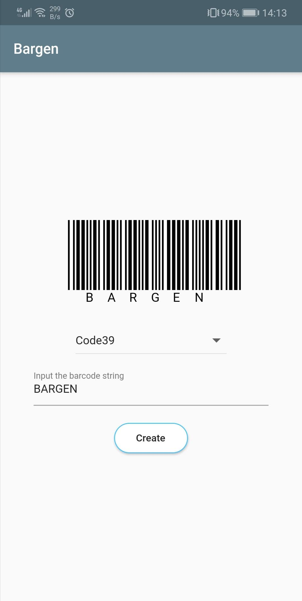

# bargen

bargen is Barcode Generator App for Android created by Flutter.



## Features

- Generate a Barcode.
- Generate a QRCode(Not implemented).
- for Android.
- for iOS(Not tested).

## Install

> **Requirement** Have to have flutter development environment.

1. Connects your Android device.
2. Clones this project and `cd` there.

```
$ git clone https://github.com/yasukotelin/bargen.git
$ cd bargen
```

3. Build for Android APK with `flutter ` command.

```
$ flutter build apk
```

4. Finally Installs your device.

```
$ flutter install
```

